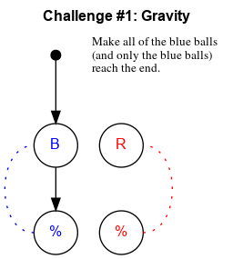
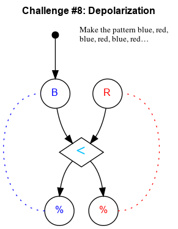
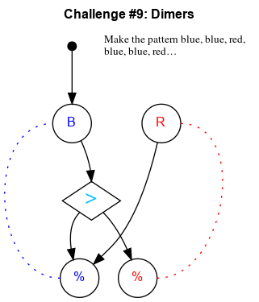
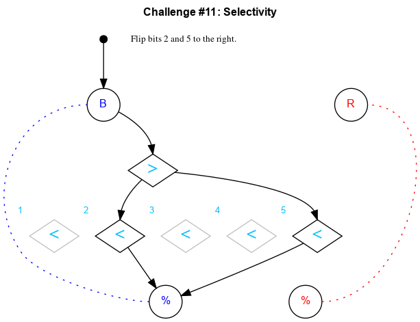

# Turing Tumble Educator Guide

## Challenge #1: Gravity

### Objective

Make all of the blue balls (and only the blue balls) reach the end.

### Setup

`init:8B-8R; start:B; trace:8B`

### Solution

	 ___o    ___
	|  .\. .-.  |
	| .-./.-.-. |
	|.-.\.-.-.-.|
	|-.-./.-.-.-|
	|.-.\.-.-.-.|
	|-.-./.-.-.-|
	|.-.\.-.-.-.|
	|-.-./.-.-.-|
	|.-.\.-.-.-.|
	|-.-./.-.-.-|
	|     -     |
	|____% %____|

### Diagram

## Challenge #2: Re-entry

### Objective

Make all of the blue balls (and only the blue balls) reach the end.

### Setup

`init:8B-8R; start:B; trace:8B`

### Solution

	 ___o    ___
	|  .\. .-.  |
	| .-.\.-.-. |
	|.-.-.\.-.-.|
	|-.-.-.\.-.-|
	|.-.-.-.\.-.|
	|-.-.-.-.\.-|
	|.-.-.-.-./.|
	|-.-.-.-./.-|
	|.-.-.-./.-.|
	|-.-.-./.-.-|
	|     /     |
	|____% %____|

### Diagram

## Challenge #3: Ignition

### Objective

Release one blue ball and then all of the red balls.

### Setup

`init:8B-8R; start:B; trace:8RB`

### Solution

	 ___o    ___
	|  .\. ./.  |
	| .-.\./.-. |
	|.-.-.\.-.-.|
	|-.-.-.\.-.-|
	|.-.-.-.\.-.|
	|-.-.-.-.\.-|
	|.-.-.-.-./.|
	|-.-.-.-.\.-|
	|.-.-.-.-./.|
	|-.-.-.-.\.-|
	|     -     |
	|____% %____|

### Diagram

## Challenge #4: Fusion

### Objective

Release one red ball and then all of the blue balls.

### Setup

`init:8B-8R; start:R; trace:8BR`

### Solution

	 ___    o___
	|  ./. .\.  |
	| ./.-.-.\. |
	|./.-.-.-.\.|
	|\.-.-.-.-./|
	|.\.-.-.-./.|
	|-.\.-.-./.-|
	|.-.\.-./.-.|
	|-.-.\./.-.-|
	|.-.-./.-.-.|
	|-.-./.-.-.-|
	|     -     |
	|____% %____|

### Diagram

## Challenge #5: Entropy

### Objective

Make the pattern blue, red, blue, red, blue, red…

### Setup

`init:8B-8R; start:B; trace:8(RB)`

### Solution

	 ___o    ___
	|  .\. ./.  |
	| .-.\./.-. |
	|.-.-.X.-.-.|
	|-.-./.\.-.-|
	|.-.\.-./.-.|
	|-.-./.\.-.-|
	|.-.\.-./.-.|
	|-.-./.\.-.-|
	|.-.\.-./.-.|
	|-.-./.\.-.-|
	|     -     |
	|____% %____|

### Diagram

## Challenge #6: Total Internal Reflection

### Objective

Make the pattern blue, red, blue, red, blue, red…

### Setup

`init:8B-8R; start:B; trace:8(RB)`

### Solution

	 ___o    ___
	|  .\. ./.  |
	| .-.\./.-. |
	|.-.-.X.-.-.|
	|-.-.\./.-.-|
	|.-.-.X.-.-.|
	|-.-.\./.-.-|
	|.-.-.X.-.-.|
	|-.-.\./.-.-|
	|.-.-.X.-.-.|
	|-.-.\./.-.-|
	|     X     |
	|____% %____|

### Diagram

## Challenge #7: Path of Least Resistance

### Objective

Create a path for the blue balls to reach the output with only 6 ramps.

### Setup

`init:8B-8R; start:B; trace:8B`

### Solution

	 ___o    ___
	|  .\. .-.  |
	| .-./.-.-. |
	|.-.X.X.-.-.|
	|-./.-.-.-.-|
	|.X.-.-.-.-.|
	|\.-.X.-.-.-|
	|.\.-.-.-.-.|
	|-.X.-.-.-.-|
	|.-.X.-.-.-.|
	|-.-./.-.-.-|
	|     -     |
	|____% %____|

### Diagram

## Challenge #8: Depolarization

### Objective

Make the pattern blue, red, blue, red, blue, red…

### Setup

`init:8B-8R; start:B; trace:8(RB)`

### Solution

	 ___o    ___
	|  .\. ./.  |
	| .-.\./.-. |
	|.-.-.<.-.-.|
	|-.-./.\.-.-|
	|.-.\.-./.-.|
	|-.-./.\.-.-|
	|.-.\.-./.-.|
	|-.-./.\.-.-|
	|.-.\.-./.-.|
	|-.-./.\.-.-|
	|     -     |
	|____% %____|

### Diagram

## Challenge #9: Dimers

### Objective

Make the pattern blue, blue, red, blue, blue, red…

### Setup

`init:10B-10R; start:B; trace:5(RBB)`

### Solution

	 ___o    ___
	|  .>. ./.  |
	| .\.\./.-. |
	|.-.\.X.-.-.|
	|-.-./.\.-.-|
	|.-.\.-./.-.|
	|-.-./.\.-.-|
	|.-.\.-./.-.|
	|-.-./.\.-.-|
	|.-.\.-./.-.|
	|-.-./.\.-.-|
	|     -     |
	|____% %____|

### Diagram

## Challenge #10: Double Bond

### Objective

Make the pattern blue, blue, red, red, blue, blue, red, red…

### Setup

`init:8B-8R; start:B; trace:4(RRBB)`

### Solution

	 ___o    ___
	|  .>. .<.  |
	| .\.\././. |
	|.-.\.X./.-.|
	|-.-./.\.-.-|
	|.-.\.-./.-.|
	|-.-./.\.-.-|
	|.-.\.-./.-.|
	|-.-./.\.-.-|
	|.-.\.-./.-.|
	|-.-./.\.-.-|
	|     -     |
	|____% %____|

### Diagram

## Challenge #11: Selectivity

### Objective

Flip bits 2 and 5 to the right.

### Setup

`init:2B-0R; start:B; trace:BB`

### Solution

	 ___o    ___
	|  .\. .-.  |
	| .-.\.-.-. |
	|.-.-.>.-.-.|
	|-.-./.\.-.-|
	|.-./.-.\.-.|
	|-.\.-.-.\.-|
	|.<.<.<.<.<.|
	|-.-./.-.-./|
	|.-./.-.-./.|
	|-./.-.-./.-|
	|     -     |
	|____% %____|

### Diagram

## Challenge #12: Duality - Part 1

### Objective

Intercept a blue ball.

### Setup

`init:8B-8R; start:B; trace:b`

### Solution

	 ___o    ___
	|  .\. .-.  |
	| .-.\.-.-. |
	|.-.-.<.-.-.|
	|-.-.-.\.-.-|
	|.-.-.-.\.-.|
	|-.-.-.-./.-|
	|.-.-.-./.-.|
	|-.-.-./.-.-|
	|.-.-.U.-.-.|
	|-.-.-.-.-.-|
	|     -     |
	|____% %____|

## Challenge #13: Duality - Part 2

### Objective

Intercept a red ball.

### Setup

`init:8B-8R; start:B; trace:rB`

### Solution

	 ___o    ___
	|  .\. .\.  |
	| .-.\.-./. |
	|.-.-.>./.-.|
	|-.-./.\.-.-|
	|.-./.-.\.-.|
	|-./.-.-./.-|
	|.\.-.-./.-.|
	|-.\.-./.-.-|
	|.-.\.U.-.-.|
	|-.-.\.-.-.-|
	|     \     |
	|____% %____|

## Challenge #14: Duality - Part 3

### Objective

If the machine starts with bit A pointing to the left, intercept a blue ball. Otherwise, intercept a red ball.

### Setup

`init:8B-8R; start:B; trace:b|rB`

### Solution

	 ___o    ___
	|  .\. .\.  |
	| .-.\.-./. |
	|.-.-.^./.-.| A
	|-.-./.\.-.-|
	|.-./.-.\.-.|
	|-./.-.-./.-|
	|.\.-.-./.-.|
	|-.\.-./.-.-|
	|.-.\.U.-.-.|
	|-.-.\.-.-.-|
	|     \     |
	|____% %____|

## Challenge #15: Inversion

### Objective

If bit A starts to the left, intercept a blue ball. If bit A starts to the right, intercept a red ball.

### Setup

`init:8B-8R; start:B; trace:bB|rB`

### Solution

	 ___o    ___
	|  .>. ./.  |
	| .\.\./.-. |
	|.-./.U.-.-.|
	|-.\.-.-.-.-|
	|.-./.-.-.-.|
	|-.\.-.-.-.-|
	|.-.\.-.-.-.|
	|-.-.\.-.-.-|
	|.-.-.^.-.-.| A
	|-.-.\./.-.-|
	|     X     |
	|____% %____|

## Challenge #16: Termination

### Objective

Let only 3 blue balls reach the bottom and catch the 4th ball in the interceptor.

### Setup

`init:8B-8R; start:B; trace:bBBB`

### Solution

	 ___o    ___
	|  .<. .-.  |
	| .\.\.-.-. |
	|.-.<./.-.-.|
	|-.U.\.-.-.-|
	|.-.-./.-.-.|
	|-.-.\.-.-.-|
	|.-.-./.-.-.|
	|-.-.\.-.-.-|
	|.-.-./.-.-.|
	|-.-./.-.-.-|
	|     -     |
	|____% %____|

## Challenge #17: Fixed Ratio

### Objective

Make the pattern blue, blue, blue, red, red, red.

### Setup

`init:8B-8R; start:B; trace:r3R3B`

### Solution

	 ___o    ___
	|  .<. .<.  |
	| ././.\.\. |
	|.\.>.-.<./.|
	|-./.\.U.\.-|
	|.\.-.\.-./.|
	|-./.-.\.\.-|
	|.\.-.-.\./.|
	|-./.-.-.\.-|
	|.\.-.-.-./.|
	|-./.-.-.\.-|
	|     -     |
	|____% %____|

## Challenge #18: Entanglement

### Objective

If the top bit AND the bottom bit start pointed to the right, put a ball in interceptor left. Otherwise put a ball in interceptor right.

### Setup

`init:8B-8R; start:B; trace:b`

### Solution

	 ___o    ___
	|  .\. .-.  |
	| .-.\.-.-. |
	|.-.-.^.-.-.|
	|-.-.\.\.-.-|
	|.-.-.^./.-.|
	|-.-./.\.-.-|
	|.-.U.-.U.-.|
	|-.-.-.-.-.-|
	|.-.-.-.-.-.|
	|-.-.-.-.-.-|
	|     -     |
	|____% %____|

## Challenge #19: Entanglement

### Objective

If the top bit AND the bottom bit start pointed to the right, intercept a blue ball. Otherwise, intercept a red ball.

### Setup

`init:8B-8R; start:B; trace:b|rB`

### Solution

	 ___o    ___
	|  .\. .\.  |
	| .-.\.-.\. |
	|.-.-.^.-.\.|
	|-.-.\.\.-./|
	|.-.-.^./.\.|
	|-.-./.\.-./|
	|.-./.-.\./.|
	|-./.-.-.X.-|
	|.-.\.-./.\.|
	|-.-.\./.-./|
	|     U     |
	|____% %____|

## Challenge #19′: Entanglement

### Objective

If the top bit AND the bottom bit start pointed to the right, intercept a blue ball. Otherwise, intercept a red ball.

### Setup

`init:8B-8R; start:B; trace:b|rB`

### Solution

	 ___o    ___
	|  .\. ./.  |
	| .-.\.\.-. |
	|.-.-.^.\.-.|
	|-.-.\.\./.-|
	|.-.-.^.X.-.|
	|-.-.\.X./.-|
	|.-.-./.\.-.|
	|-.-.\.-./.-|
	|.-.-./.\.-.|
	|-.-.\.-./.-|
	|     U     |
	|____% %____|

## Challenge #19″: Entanglement

### Objective

If the top bit AND the bottom bit start pointed to the right, intercept a blue ball. Otherwise, intercept a red ball.

### Setup

`init:8B-8R; start:B; trace:b|rB|rRB|rRRB`

### Solution

	 ___o    ___
	|  .\. ./.  |
	| .-.\./.-. |
	|.-.-.^.-.-.|
	|-.-.\.\.-.-|
	|.-.-.^./.-.|
	|-.-.\./.-.-|
	|.-.-.X.-.-.|
	|-.-.\./.-.-|
	|.-.-.X.-.-.|
	|-.-.\.\.-.-|
	|     U     |
	|____% %____|

## Challenge #20: Symbiosis

### Objective

If the top bit OR the bottom bit start pointed to the right, intercept a blue ball. Otherwise, intercept a red ball.

### Setup

`init:8B-8R; start:B; trace:b|rB`

### Solution

	 ___o    ___
	|  .\. .\.  |
	| .-.\.-.\. |
	|.-.-.^.-.\.|
	|-.-././.-./|
	|.-.\.^.-.\.|
	|-.-./.\.-./|
	|.-.\.-.\./.|
	|-.-./.-.X.-|
	|.-.\.-./.\.|
	|-.-.\./.-./|
	|     U     |
	|____% %____|

## Challenge #20′: Symbiosis

### Objective

If the top bit OR the bottom bit start pointed to the right, intercept a blue ball. Otherwise, intercept a red ball.

### Setup

`init:8B-8R; start:B; trace:b|rB`

### Solution

	 ___o    ___
	|  .\. ./.  |
	| .-.\./.-. |
	|.-.-.^.-.-.|
	|-.-././.-.-|
	|.-.\.^.-.-.|
	|-.-.\./.-.-|
	|.-.-.X.-.-.|
	|-.-.\./.-.-|
	|.-.-.X.-.-.|
	|-.-.\.\.-.-|
	|     U     |
	|____% %____|

## Challenge #21: Quantum Number

### Objective

Use register A to count the number of blue balls. Use 15 or fewer balls.

### Setup

`init:15B-0R; start:B; trace:15B`

	 ___o    ___
	|  .<. .-.  |
	| .\.\.-.-. |
	|.-.<./.-.-.|
	|-.\.\.-.-.-|
	|.-.<./.-.-.|
	|-.\.\.-.-.-|
	|.-.<./.-.-.|
	|-.\.\.-.-.-|
	|.-.\./.-.-.|
	|-.-.\.-.-.-|
	|     /     |
	|____% %____|

### Diagram

## Challenge #22: Depletion

### Objective

Register A starts at 15. Subtract the number of blue balls from the register. (Use 15 or fewer balls.)

### Setup

`init:15B 0R; start:B; trace:15B`

### Solution

	 ___o    ___
	|  .>. .-.  |
	| ././.-.-. |
	|.\.>.-.-.-.|
	|-././.-.-.-|
	|.\.>.-.-.-.|
	|-././.-.-.-|
	|.\.>.-.-.-.|
	|-././.-.-.-|
	|.\./.-.-.-.|
	|-./.-.-.-.-|
	|     -     |
	|____% %____|

## Challenge #23: Tetrad

### Objective

Let exactly 4 blue balls reach the end. (Intercept the 5th.)

### Setup

`init:8B-8R; start:B; trace:b4B`

### Solution

	 ___o    ___
	|  .<. .-.  |
	| ././.-.-. |
	|.\.<.-.-.-.|
	|-././.-.-.-|
	|.\.>.-.-.-.|
	|-./.U.-.-.-|
	|.\.-.-.-.-.|
	|-./.-.-.-.-|
	|.\.-.-.-.-.|
	|-./.-.-.-.-|
	|     -     |
	|____% %____|

## Challenge #24: Ennead

### Objective

Let exactly 9 blue balls reach the end. (Intercept the 10th.)

### Setup

`init:12B 12R; start:B; trace:b9B`

### Solution

	 ___o    ___
	|  .>. .-.  |
	| ././.-.-. |
	|.\.<.-.-.-.|
	|-././.-.-.-|
	|.\.<.-.-.-.|
	|-././.-.-.-|
	|.\.>.-.-.-.|
	|-./.U.-.-.-|
	|.\.-.-.-.-.|
	|-./.-.-.-.-|
	|     -     |
	|____% %____|

## Challenge #25: Regular Expression

### Objective

Generate the pattern 3R6B.

### Setup

`init:8B-8R; start:B; trace:r3R6B`

### Solution

	 ___o    ___
	|  .>. .>.  |
	| ././././. |
	|.\.<.\.>.-.|
	|-./././.U.-|
	|.\.>./.-.-.|
	|-./.\.-.-.-|
	|.\.-.\.-.-.|
	|-./.-.\.-.-|
	|.\.-.-.\.-.|
	|-./.-.-.\.-|
	|     -     |
	|____% %____|

## Challenge #26: Nucleus

### Objective

Generate the pattern 4B1R4B.

### Setup

`init:10B-10R; start:B; trace:r4B1R4B`

### Solution

	 ___o    ___
	|  .>. .>.  |
	| ./././.U. |
	|.\.>./.-.-.|
	|-./.X.-.-.-|
	|.\./.\.-.-.|
	|-./.-.\.-.-|
	|.\.-.-./.-.|
	|-./.-.\.-.-|
	|.\.-.-./.-.|
	|-./.-.\.-.-|
	|     -     |
	|____% %____|

## Challenge #27: Reflection

### Objective

Reverse the direction of each of the 9 starting bits, regardless of the direction they point to start

### Setup

`init:8B-8R; start:B; trace:rBB`

### Solution

	 ___o   o___
	|  .>. .\.  |
	| .^.\.-.^. |
	|.\./.^.\./.|
	|-.^.\./.U.-|
	|.\./.^.-.-.|
	|-.^.\./.-.-|
	|.\./.^.-.-.|
	|-.^.\./.-.-|
	|.\./.^.-.-.|
	|-./.\./.-.-|
	|     \     |
	|____% %____|

## Challenge #28: Latch

### Objective

Release only the blue balls.

### Setup

`init:8B-8R; start:B; trace:8B`

### Solution

	 ___o    ___
	|  .\. .-.  |
	| .-.\.-.-. |
	|.-.-.}.-.-.|
	|-.-.}*-.-.-|
	|.-.-./.-.-.|
	|-.-./.-.-.-|
	|.-.\.-.-.-.|
	|-.-./.-.-.-|
	|.-.\.-.-.-.|
	|-.-./.-.-.-|
	|     -     |
	|____% %____|

## Challenge #29: One-Shot Switch

### Objective

Release a blue ball, a red ball, and then the rest of the blue balls.

### Setup

`init:8B-8R; start:B; trace:7BRB`

### Solution

	 ___o    ___
	|  .{. ./.  |
	| .{*\./.-. |
	|.-.\.X.-.-.|
	|-.-./.\.-.-|
	|.-.\.-./.-.|
	|-.-./.\.-.-|
	|.-.\.-./.-.|
	|-.-./.\.-.-|
	|.-.\.-./.-.|
	|-.-./.\.-.-|
	|     -     |
	|____% %____|

## Challenge #30: Overflow

### Objective

Count the blue balls in register A. If there are more than 7, gear bit OV must flip right (and stay right) to indicate the overflow.

### Setup

`init:*B-0R; start:B; trace:*B`

### Solution

	 ___o    ___
	|  .<. .-.  |
	| .\.\.-.-. |
	|.-.<./.-.-.|
	|-.\.\.-.-.-|
	|.-.<./.-.-.|
	|-*{./.-.-.-|OV
	|.{./.-.-.-.|
	|\./.-.-.-.-|
	|./.-.-.-.-.|
	|\.-.-.-.-.-|
	|     -     |
	|____% %____|

