# Turing Tumble Educator Guide

Solutions to all _Turing Tumble_ puzzles in the _Educator Guide_
(see the [notation](LEGEND.md) used in the solutions).

* [Challenge #1: Gravity](#challenge-1-gravity)
* [Challenge #2: Re-entry](#challenge-2-re-entry)
* [Challenge #3: Ignition](#challenge-3-ignition)
* [Challenge #4: Fusion](#challenge-4-fusion)
* [Challenge #5: Entropy](#challenge-5-entropy)
* [Challenge #6: Total Internal Reflection](#challenge-6-total-internal-reflection)
* [Challenge #7: Path of Least Resistance](#challenge-7-path-of-least-resistance)
* [Challenge #8: Depolarization](#challenge-8-depolarization)
* [Challenge #9: Dimers](#challenge-9-dimers)
* [Challenge #10: Double Bond](#challenge-10-double-bond)
* [Challenge #11: Selectivity](#challenge-11-selectivity)
* [Challenge #12: Duality - Part 1](#challenge-12-duality---part-1)
* [Challenge #13: Duality - Part 2](#challenge-13-duality---part-2)
* [Challenge #14: Duality - Part 3](#challenge-14-duality---part-3)
* [Challenge #15: Inversion](#challenge-15-inversion)
* [Challenge #16: Termination](#challenge-16-termination)
* [Challenge #17: Fixed Ratio](#challenge-17-fixed-ratio)
* [Challenge #18: Entanglement](#challenge-18-entanglement)
* [Challenge #19: Entanglement](#challenge-19-entanglement)
* [Challenge #20: Symbiosis](#challenge-29-symbiosis)
* [Challenge #21: Quantum Number](#challenge-21-quantum-number)
* [Challenge #22: Depletion](#challenge-22-depletion)
* [Challenge #23: Tetrad](#challenge-23-tetrad)
* [Challenge #24: Ennead](#challenge-24-ennead)
* [Challenge #25: Regular Expression](#challenge-25-regular-expression)
* [Challenge #26: Nucleus](#challenge-26-nucleus)
* [Challenge #27: Reflection](#challenge-27-reflection)
* [Challenge #28: Latch](#challenge-28-Latch)
* [Challenge #29: One-Shot Switch](#challenge-29-one-shot-switch)
* [Challenge #30: Overflow](#challenge-30-overflow)

## Challenge #1: Gravity

### Objective

Make all of the blue balls (and only the blue balls) reach the end.

### Setup

`balls:8B-8R; start:B; trace:8B`

### Solution

	 ___o    ___
	|  .\. .-.  |
	| .-./.-.-. |
	|.-.\.-.-.-.|
	|-.-./.-.-.-|
	|.-.\.-.-.-.|
	|-.-./.-.-.-|
	|.-.\.-.-.-.|
	|-.-./.-.-.-|
	|.-.\.-.-.-.|
	|-.-./.-.-.-|
	|     -     |
	|____% %____|

### Diagram

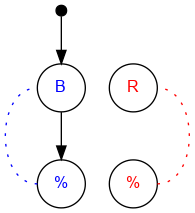

#### Standalone images

Images with title text and objective description:
[SVG](../graph/SVG/puzzle01.svg),
[PNG](../graph/PNG/puzzle01.png),
[PDF](../graph/PDF/puzzle01.pdf).

## Challenge #2: Re-entry

### Objective

Make all of the blue balls (and only the blue balls) reach the end.

### Setup

`balls:8B-8R; start:B; trace:8B`

### Solution

	 ___o    ___
	|  .\. .-.  |
	| .-.\.-.-. |
	|.-.-.\.-.-.|
	|-.-.-.\.-.-|
	|.-.-.-.\.-.|
	|-.-.-.-.\.-|
	|.-.-.-.-./.|
	|-.-.-.-./.-|
	|.-.-.-./.-.|
	|-.-.-./.-.-|
	|     /     |
	|____% %____|

### Diagram

#### Standalone images

Images with title text and objective description:
[SVG](../graph/SVG/puzzle02.svg),
[PNG](../graph/PNG/puzzle02.png),
[PDF](../graph/PDF/puzzle02.pdf).

## Challenge #3: Ignition

### Objective

Release one blue ball and then all of the red balls.

### Setup

`balls:8B-8R; start:B; trace:8RB`

### Solution

	 ___o    ___
	|  .\. ./.  |
	| .-.\./.-. |
	|.-.-.\.-.-.|
	|-.-.-.\.-.-|
	|.-.-.-.\.-.|
	|-.-.-.-.\.-|
	|.-.-.-.-./.|
	|-.-.-.-.\.-|
	|.-.-.-.-./.|
	|-.-.-.-.\.-|
	|     -     |
	|____% %____|

### Diagram

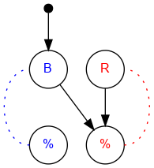

#### Standalone images

Images with title text and objective description:
[SVG](../graph/SVG/puzzle03.svg),
[PNG](../graph/PNG/puzzle03.png),
[PDF](../graph/PDF/puzzle03.pdf).

## Challenge #4: Fusion

### Objective

Release one red ball and then all of the blue balls.

### Setup

`balls:8B-8R; start:R; trace:8BR`

### Solution

	 ___    o___
	|  ./. .\.  |
	| ./.-.-.\. |
	|./.-.-.-.\.|
	|\.-.-.-.-./|
	|.\.-.-.-./.|
	|-.\.-.-./.-|
	|.-.\.-./.-.|
	|-.-.\./.-.-|
	|.-.-./.-.-.|
	|-.-./.-.-.-|
	|     -     |
	|____% %____|

### Diagram

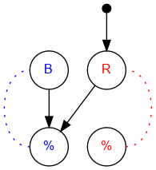

#### Standalone images

Images with title text and objective description:
[SVG](../graph/SVG/puzzle04.svg),
[PNG](../graph/PNG/puzzle04.png),
[PDF](../graph/PDF/puzzle04.pdf).

## Challenge #5: Entropy

### Objective

Make the pattern blue, red, blue, red, blue, red…

### Setup

`balls:8B-8R; start:B; trace:8(RB)`

### Solution

	 ___o    ___
	|  .\. ./.  |
	| .-.\./.-. |
	|.-.-.X.-.-.|
	|-.-./.\.-.-|
	|.-.\.-./.-.|
	|-.-./.\.-.-|
	|.-.\.-./.-.|
	|-.-./.\.-.-|
	|.-.\.-./.-.|
	|-.-./.\.-.-|
	|     -     |
	|____% %____|

### Diagram

#### Standalone images

Images with title text and objective description:
[SVG](../graph/SVG/puzzle05.svg),
[PNG](../graph/PNG/puzzle05.png),
[PDF](../graph/PDF/puzzle05.pdf).

## Challenge #6: Total Internal Reflection

### Objective

Make the pattern blue, red, blue, red, blue, red…

### Setup

`balls:8B-8R; start:B; trace:8(RB)`

### Solution

	 ___o    ___
	|  .\. ./.  |
	| .-.\./.-. |
	|.-.-.X.-.-.|
	|-.-.\./.-.-|
	|.-.-.X.-.-.|
	|-.-.\./.-.-|
	|.-.-.X.-.-.|
	|-.-.\./.-.-|
	|.-.-.X.-.-.|
	|-.-.\./.-.-|
	|     X     |
	|____% %____|

### Diagram

#### Standalone images

Images with title text and objective description:
[SVG](../graph/SVG/puzzle06.svg),
[PNG](../graph/PNG/puzzle06.png),
[PDF](../graph/PDF/puzzle06.pdf).

## Challenge #7: Path of Least Resistance

### Objective

Create a path for the blue balls to reach the output with only 6 ramps.

### Setup

`balls:8B-8R; start:B; trace:8B`

### Solution

	 ___o    ___
	|  .\. .-.  |
	| .-./.-.-. |
	|.-.X.X.-.-.|
	|-./.-.-.-.-|
	|.X.-.-.-.-.|
	|\.-.X.-.-.-|
	|.\.-.-.-.-.|
	|-.X.-.-.-.-|
	|.-.X.-.-.-.|
	|-.-./.-.-.-|
	|     -     |
	|____% %____|

### Diagram

#### Standalone images

Images with title text and objective description:
[SVG](../graph/SVG/puzzle07.svg),
[PNG](../graph/PNG/puzzle07.png),
[PDF](../graph/PDF/puzzle07.pdf).

## Challenge #8: Depolarization

### Objective

Make the pattern blue, red, blue, red, blue, red…

### Setup

`balls:8B-8R; start:B; trace:8(RB)`

### Solution

	 ___o    ___
	|  .\. ./.  |
	| .-.\./.-. |
	|.-.-.<.-.-.|
	|-.-./.\.-.-|
	|.-.\.-./.-.|
	|-.-./.\.-.-|
	|.-.\.-./.-.|
	|-.-./.\.-.-|
	|.-.\.-./.-.|
	|-.-./.\.-.-|
	|     -     |
	|____% %____|

### Diagram

#### Standalone images

Images with title text and objective description:
[SVG](../graph/SVG/puzzle08.svg),
[PNG](../graph/PNG/puzzle08.png),
[PDF](../graph/PDF/puzzle08.pdf).

## Challenge #9: Dimers

### Objective

Make the pattern blue, blue, red, blue, blue, red…

### Setup

`balls:10B-10R; start:B; trace:5(RBB)`

### Solution

	 ___o    ___
	|  .>. ./.  |
	| .\.\./.-. |
	|.-.\.X.-.-.|
	|-.-./.\.-.-|
	|.-.\.-./.-.|
	|-.-./.\.-.-|
	|.-.\.-./.-.|
	|-.-./.\.-.-|
	|.-.\.-./.-.|
	|-.-./.\.-.-|
	|     -     |
	|____% %____|

### Diagram

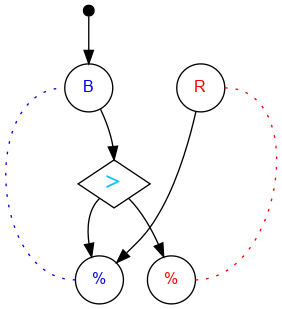

#### Standalone images

Images with title text and objective description:
[SVG](../graph/SVG/puzzle09.svg),
[PNG](../graph/PNG/puzzle09.png),
[PDF](../graph/PDF/puzzle09.pdf).

## Challenge #10: Double Bond

### Objective

Make the pattern blue, blue, red, red, blue, blue, red, red…

### Setup

`balls:8B-8R; start:B; trace:4(RRBB)`

### Solution

	 ___o    ___
	|  .>. .<.  |
	| .\.\././. |
	|.-.\.X./.-.|
	|-.-./.\.-.-|
	|.-.\.-./.-.|
	|-.-./.\.-.-|
	|.-.\.-./.-.|
	|-.-./.\.-.-|
	|.-.\.-./.-.|
	|-.-./.\.-.-|
	|     -     |
	|____% %____|

### Diagram

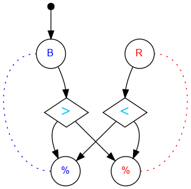

#### Standalone images

Images with title text and objective description:
[SVG](../graph/SVG/puzzle10.svg),
[PNG](../graph/PNG/puzzle10.png),
[PDF](../graph/PDF/puzzle10.pdf).

## Challenge #11: Selectivity

### Objective

Flip bits 2 and 5 to the right.

### Setup

`balls:2B-0R; start:B; trace:BB`

### Solution

	 ___o    ___
	|  .\. .-.  |
	| .-.\.-.-. |
	|.-.-.>.-.-.|
	|-.-./.\.-.-|
	|.-./.-.\.-.|
	|-.\.-.-.\.-|
	|.<.<.<.<.<.|
	|-.-./.-.-./|
	|.-./.-.-./.|
	|-./.-.-./.-|
	|     -     |
	|____% %____|

### Diagram

#### Standalone images

Images with title text and objective description:
[SVG](../graph/SVG/puzzle11.svg),
[PNG](../graph/PNG/puzzle11.png),
[PDF](../graph/PDF/puzzle11.pdf).

## Challenge #12: Duality - Part 1

### Objective

Intercept a blue ball.

### Setup

`balls:8B-8R; start:B; trace:b`

### Solution

	 ___o    ___
	|  .\. .-.  |
	| .-.\.-.-. |
	|.-.-.<.-.-.|
	|-.-.-.\.-.-|
	|.-.-.-.\.-.|
	|-.-.-.-./.-|
	|.-.-.-./.-.|
	|-.-.-./.-.-|
	|.-.-.U.-.-.|
	|-.-.-.-.-.-|
	|     -     |
	|____% %____|

### Diagram

#### Standalone images

Images with title text and objective description:
[SVG](../graph/SVG/puzzle12.svg),
[PNG](../graph/PNG/puzzle12.png),
[PDF](../graph/PDF/puzzle12.pdf).

## Challenge #13: Duality - Part 2

### Objective

Intercept a red ball.

### Setup

`balls:8B-8R; start:B; trace:rB`

### Solution

	 ___o    ___
	|  .\. .\.  |
	| .-.\.-./. |
	|.-.-.>./.-.|
	|-.-./.\.-.-|
	|.-./.-.\.-.|
	|-./.-.-./.-|
	|.\.-.-./.-.|
	|-.\.-./.-.-|
	|.-.\.U.-.-.|
	|-.-.\.-.-.-|
	|     \     |
	|____% %____|

### Diagram

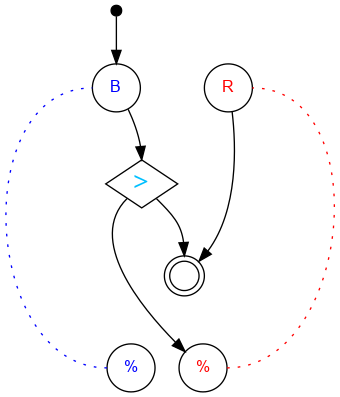

#### Standalone images

Images with title text and objective description:
[SVG](../graph/SVG/puzzle13.svg),
[PNG](../graph/PNG/puzzle13.png),
[PDF](../graph/PDF/puzzle13.pdf).

## Challenge #14: Duality - Part 3

### Objective

If the machine starts with bit A pointing to the left, intercept a blue ball. Otherwise, intercept a red ball.

### Setup

`balls:8B-8R; start:B; trace:b|rB`

### Solution

	 ___o    ___
	|  .\. .\.  |
	| .-.\.-./. |
	|.-.-.^./.-.| A
	|-.-./.\.-.-|
	|.-./.-.\.-.|
	|-./.-.-./.-|
	|.\.-.-./.-.|
	|-.\.-./.-.-|
	|.-.\.U.-.-.|
	|-.-.\.-.-.-|
	|     \     |
	|____% %____|

### Diagram

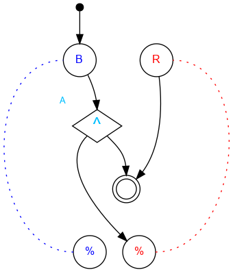

#### Standalone images

Images with title text and objective description:
[SVG](../graph/SVG/puzzle14.svg),
[PNG](../graph/PNG/puzzle14.png),
[PDF](../graph/PDF/puzzle14.pdf).

## Challenge #15: Inversion

### Objective

If bit A starts to the left, intercept a blue ball. If bit A starts to the right, intercept a red ball.

### Setup

`balls:8B-8R; start:B; trace:bB|rB`

### Solution

	 ___o    ___
	|  .>. ./.  |
	| .\.\./.-. |
	|.-./.U.-.-.|
	|-.\.-.-.-.-|
	|.-./.-.-.-.|
	|-.\.-.-.-.-|
	|.-.\.-.-.-.|
	|-.-.\.-.-.-|
	|.-.-.^.-.-.| A
	|-.-.\./.-.-|
	|     X     |
	|____% %____|

### Diagram

#### Standalone images

Images with title text and objective description:
[SVG](../graph/SVG/puzzle15.svg),
[PNG](../graph/PNG/puzzle15.png),
[PDF](../graph/PDF/puzzle15.pdf).

## Challenge #16: Termination

### Objective

Let only 3 blue balls reach the bottom and catch the 4th ball in the interceptor.

### Setup

`balls:8B-8R; start:B; trace:bBBB`

### Solution

	 ___o    ___
	|  .<. .-.  |
	| .\.\.-.-. |
	|.-.<./.-.-.|
	|-.U.\.-.-.-|
	|.-.-./.-.-.|
	|-.-.\.-.-.-|
	|.-.-./.-.-.|
	|-.-.\.-.-.-|
	|.-.-./.-.-.|
	|-.-./.-.-.-|
	|     -     |
	|____% %____|

### Diagram

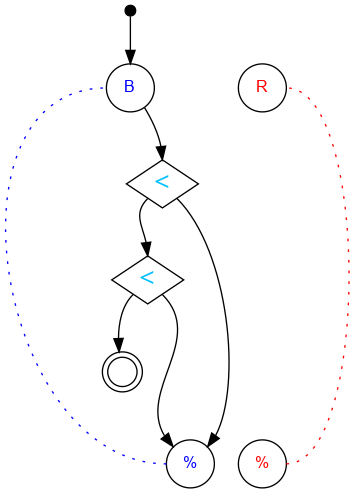

#### Standalone images

Images with title text and objective description:
[SVG](../graph/SVG/puzzle16.svg),
[PNG](../graph/PNG/puzzle16.png),
[PDF](../graph/PDF/puzzle16.pdf).

## Challenge #17: Fixed Ratio

### Objective

Make the pattern blue, blue, blue, red, red, red.

### Setup

`balls:8B-8R; start:B; trace:r3R3B`

### Solution

	 ___o    ___
	|  .<. .<.  |
	| ././.\.\. |
	|.\.>.-.<./.|
	|-./.\.U.\.-|
	|.\.-.\.-./.|
	|-./.-.\.\.-|
	|.\.-.-.\./.|
	|-./.-.-.\.-|
	|.\.-.-.-./.|
	|-./.-.-.\.-|
	|     -     |
	|____% %____|

### Diagram

#### Standalone images

Images with title text and objective description:
[SVG](../graph/SVG/puzzle17.svg),
[PNG](../graph/PNG/puzzle17.png),
[PDF](../graph/PDF/puzzle17.pdf).

## Challenge #18: Entanglement

### Objective

If the top bit AND the bottom bit start pointed to the right, put a ball in interceptor left. Otherwise put a ball in interceptor right.

### Setup

`balls:8B-8R; start:B; trace:b`

### Solution

	 ___o    ___
	|  .\. .-.  |
	| .-.\.-.-. |
	|.-.-.^.-.-.|
	|-.-.\.\.-.-|
	|.-.-.^./.-.|
	|-.-./.\.-.-|
	|.-.U.-.U.-.|
	|-.-.-.-.-.-|
	|.-.-.-.-.-.|
	|-.-.-.-.-.-|
	|     -     |
	|____% %____|

### Diagram

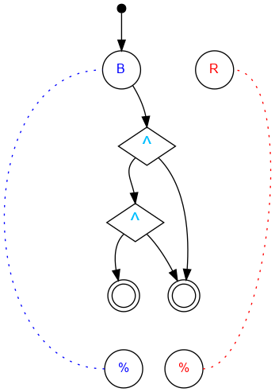

#### Standalone images

Images with title text and objective description:
[SVG](../graph/SVG/puzzle18.svg),
[PNG](../graph/PNG/puzzle18.png),
[PDF](../graph/PDF/puzzle18.pdf).

## Challenge #19: Entanglement

### Objective

If the top bit AND the bottom bit start pointed to the right, intercept a blue ball. Otherwise, intercept a red ball.

### Setup 1

`balls:8B-8R; start:B; trace:b|rB`

### Solution 1

	 ___o    ___             ___o    ___
	|  .\. .\.  |           |  .\. ./.  |
	| .-.\.-.\. |           | .-.\.\.-. |
	|.-.-.^.-.\.|           |.-.-.^.\.-.|
	|-.-.\.\.-./|           |-.-.\.\./.-|
	|.-.-.^./.\.|           |.-.-.^.X.-.|
	|-.-./.\.-./|           |-.-.\.X./.-|
	|.-./.-.\./.|           |.-.-./.\.-.|
	|-./.-.-.X.-|           |-.-.\.-./.-|
	|.-.\.-./.\.|           |.-.-./.\.-.|
	|-.-.\./.-./|           |-.-.\.-./.-|
	|     U     |           |     U     |
	|____% %____|           |____% %____|

### Diagram 1

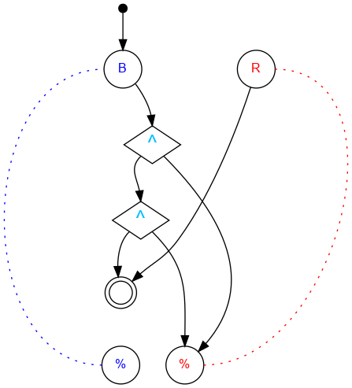

#### Standalone images

Images with title text and objective description:
[SVG](../graph/SVG/puzzle190.svg),
[PNG](../graph/PNG/puzzle190.png),
[PDF](../graph/PDF/puzzle190.pdf).

------------------------------------------------------------------------

### Setup 2

`balls:8B-8R; start:B; trace:b|rB|rRB|rRRB`

### Solution 2

	 ___o    ___
	|  .\. ./.  |
	| .-.\./.-. |
	|.-.-.^.-.-.|
	|-.-.\.\.-.-|
	|.-.-.^./.-.|
	|-.-.\./.-.-|
	|.-.-.X.-.-.|
	|-.-.\./.-.-|
	|.-.-.X.-.-.|
	|-.-.\.\.-.-|
	|     U     |
	|____% %____|

### Diagram 2

#### Standalone images

Images with title text and objective description:
[SVG](../graph/SVG/puzzle192.svg),
[PNG](../graph/PNG/puzzle192.png),
[PDF](../graph/PDF/puzzle192.pdf).

## Challenge #20: Symbiosis

### Objective

If the top bit OR the bottom bit start pointed to the right, intercept a blue ball. Otherwise, intercept a red ball.

### Setup 1

`balls:8B-8R; start:B; trace:b|rB`

### Solution 1

	 ___o    ___
	|  .\. .\.  |
	| .-.\.-.\. |
	|.-.-.^.-.\.|
	|-.-././.-./|
	|.-.\.^.-.\.|
	|-.-./.\.-./|
	|.-.\.-.\./.|
	|-.-./.-.X.-|
	|.-.\.-./.\.|
	|-.-.\./.-./|
	|     U     |
	|____% %____|

### Diagram 1

#### Standalone images

Images with title text and objective description:
[SVG](../graph/SVG/puzzle200.svg),
[PNG](../graph/PNG/puzzle200.png),
[PDF](../graph/PDF/puzzle200.pdf).

------------------------------------------------------------------------

### Setup 2

`balls:8B-8R; start:B; trace:b|rB`

### Solution 2

	 ___o    ___
	|  .\. ./.  |
	| .-.\./.-. |
	|.-.-.^.-.-.|
	|-.-././.-.-|
	|.-.\.^.-.-.|
	|-.-.\./.-.-|
	|.-.-.X.-.-.|
	|-.-.\./.-.-|
	|.-.-.X.-.-.|
	|-.-.\.\.-.-|
	|     U     |
	|____% %____|

### Diagram 2

#### Standalone images

Images with title text and objective description:
[SVG](../graph/SVG/puzzle201.svg),
[PNG](../graph/PNG/puzzle201.png),
[PDF](../graph/PDF/puzzle201.pdf).

## Challenge #21: Quantum Number

### Objective

Use register A to count the number of blue balls. Use 15 or fewer balls.

### Setup

`balls:15B-0R; start:B; trace:15B`

	 ___o    ___
	|  .<. .-.  |
	| .\.\.-.-. |
	|.-.<./.-.-.|
	|-.\.\.-.-.-|
	|.-.<./.-.-.|
	|-.\.\.-.-.-|
	|.-.<./.-.-.|
	|-.\.\.-.-.-|
	|.-.\./.-.-.|
	|-.-.\.-.-.-|
	|     /     |
	|____% %____|

### Diagram

#### Standalone images

Images with title text and objective description:
[SVG](../graph/SVG/puzzle21.svg),
[PNG](../graph/PNG/puzzle21.png),
[PDF](../graph/PDF/puzzle21.pdf).

## Challenge #22: Depletion

### Objective

Register A starts at 15. Subtract the number of blue balls from the register. (Use 15 or fewer balls.)

### Setup

`balls:15B 0R; start:B; trace:15B`

### Solution

	 ___o    ___
	|  .>. .-.  |
	| ././.-.-. |
	|.\.>.-.-.-.|
	|-././.-.-.-|
	|.\.>.-.-.-.|
	|-././.-.-.-|
	|.\.>.-.-.-.|
	|-././.-.-.-|
	|.\./.-.-.-.|
	|-./.-.-.-.-|
	|     -     |
	|____% %____|

### Diagram

#### Standalone images

Images with title text and objective description:
[SVG](../graph/SVG/puzzle22.svg),
[PNG](../graph/PNG/puzzle22.png),
[PDF](../graph/PDF/puzzle22.pdf).

## Challenge #23: Tetrad

### Objective

Let exactly 4 blue balls reach the end. (Intercept the 5th.)

### Setup

`balls:8B-8R; start:B; trace:b4B`

### Solution

	 ___o    ___
	|  .<. .-.  |
	| ././.-.-. |
	|.\.<.-.-.-.|
	|-././.-.-.-|
	|.\.>.-.-.-.|
	|-./.U.-.-.-|
	|.\.-.-.-.-.|
	|-./.-.-.-.-|
	|.\.-.-.-.-.|
	|-./.-.-.-.-|
	|     -     |
	|____% %____|

### Diagram

#### Standalone images

Images with title text and objective description:
[SVG](../graph/SVG/puzzle23.svg),
[PNG](../graph/PNG/puzzle23.png),
[PDF](../graph/PDF/puzzle23.pdf).

## Challenge #24: Ennead

### Objective

Let exactly 9 blue balls reach the end. (Intercept the 10th.)

### Setup

`balls:12B 12R; start:B; trace:b9B`

### Solution

	 ___o    ___
	|  .>. .-.  |
	| ././.-.-. |
	|.\.<.-.-.-.|
	|-././.-.-.-|
	|.\.<.-.-.-.|
	|-././.-.-.-|
	|.\.>.-.-.-.|
	|-./.U.-.-.-|
	|.\.-.-.-.-.|
	|-./.-.-.-.-|
	|     -     |
	|____% %____|

### Diagram

#### Standalone images

Images with title text and objective description:
[SVG](../graph/SVG/puzzle24.svg),
[PNG](../graph/PNG/puzzle24.png),
[PDF](../graph/PDF/puzzle24.pdf).

## Challenge #25: Regular Expression

### Objective

Generate the pattern 3R6B.

### Setup

`balls:8B-8R; start:B; trace:r3R6B`

### Solution

	 ___o    ___
	|  .>. .>.  |
	| ././././. |
	|.\.<.\.>.-.|
	|-./././.U.-|
	|.\.>./.-.-.|
	|-./.\.-.-.-|
	|.\.-.\.-.-.|
	|-./.-.\.-.-|
	|.\.-.-.\.-.|
	|-./.-.-.\.-|
	|     -     |
	|____% %____|

### Diagram

#### Standalone images

Images with title text and objective description:
[SVG](../graph/SVG/puzzle25.svg),
[PNG](../graph/PNG/puzzle25.png),
[PDF](../graph/PDF/puzzle25.pdf).

## Challenge #26: Nucleus

### Objective

Generate the pattern 4B1R4B.

### Setup

`balls:10B-10R; start:B; trace:r4B1R4B`

### Solution

	 ___o    ___
	|  .>. .>.  |
	| ./././.U. |
	|.\.>./.-.-.|
	|-./.X.-.-.-|
	|.\./.\.-.-.|
	|-./.-.\.-.-|
	|.\.-.-./.-.|
	|-./.-.\.-.-|
	|.\.-.-./.-.|
	|-./.-.\.-.-|
	|     -     |
	|____% %____|

### Diagram

#### Standalone images

Images with title text and objective description:
[SVG](../graph/SVG/puzzle26.svg),
[PNG](../graph/PNG/puzzle26.png),
[PDF](../graph/PDF/puzzle26.pdf).

## Challenge #27: Reflection

### Objective

Reverse the direction of each of the 9 starting bits, regardless of the direction they point to start

### Setup

`balls:8B-8R; start:B; trace:rBB`

### Solution

	 ___o   o___
	|  .>. .\.  |
	| .^.\.-.^. |
	|.\./.^.\./.|
	|-.^.\./.U.-|
	|.\./.^.-.-.|
	|-.^.\./.-.-|
	|.\./.^.-.-.|
	|-.^.\./.-.-|
	|.\./.^.-.-.|
	|-./.\./.-.-|
	|     \     |
	|____% %____|

### Diagram

#### Standalone images

Images with title text and objective description:
[SVG](../graph/SVG/puzzle27.svg),
[PNG](../graph/PNG/puzzle27.png),
[PDF](../graph/PDF/puzzle27.pdf).

## Challenge #28: Latch

### Objective

Release only the blue balls.

### Setup

`balls:8B-8R; start:B; trace:8B`

### Solution

	 ___o    ___
	|  .\. .-.  |
	| .-.\.-.-. |
	|.-.-.}.-.-.|
	|-.-.}*-.-.-|
	|.-.-./.-.-.|
	|-.-./.-.-.-|
	|.-.\.-.-.-.|
	|-.-./.-.-.-|
	|.-.\.-.-.-.|
	|-.-./.-.-.-|
	|     -     |
	|____% %____|

### Diagram

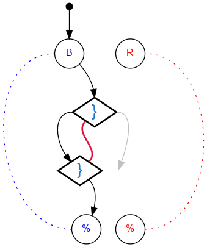

#### Standalone images

Images with title text and objective description:
[SVG](../graph/SVG/puzzle28.svg),
[PNG](../graph/PNG/puzzle28.png),
[PDF](../graph/PDF/puzzle28.pdf).

## Challenge #29: One-Shot Switch

### Objective

Release a blue ball, a red ball, and then the rest of the blue balls.

### Setup

`balls:8B-8R; start:B; trace:7BRB`

### Solution

	 ___o    ___
	|  .{. ./.  |
	| .{*\./.-. |
	|.-.\.X.-.-.|
	|-.-./.\.-.-|
	|.-.\.-./.-.|
	|-.-./.\.-.-|
	|.-.\.-./.-.|
	|-.-./.\.-.-|
	|.-.\.-./.-.|
	|-.-./.\.-.-|
	|     -     |
	|____% %____|

### Diagram

#### Standalone images

Images with title text and objective description:
[SVG](../graph/SVG/puzzle29.svg),
[PNG](../graph/PNG/puzzle29.png),
[PDF](../graph/PDF/puzzle29.pdf).

## Challenge #30: Overflow

### Objective

Count the blue balls in register A. If there are more than 7, gear bit OV must flip right (and stay right) to indicate the overflow.

### Setup

`balls:*B-0R; start:B; trace:*B`

### Solution

	 ___o    ___
	|  .<. .-.  |
	| .\.\.-.-. |
	|.-.<./.-.-.|
	|-.\.\.-.-.-|
	|.-.<./.-.-.|
	|-*{./.-.-.-|OV
	|.{./.-.-.-.|
	|\./.-.-.-.-|
	|./.-.-.-.-.|
	|\.-.-.-.-.-|
	|     -     |
	|____% %____|

### Diagram

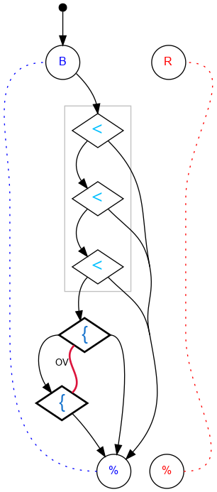

#### Standalone images

Images with title text and objective description:
[SVG](../graph/SVG/puzzle30.svg),
[PNG](../graph/PNG/puzzle30.png),
[PDF](../graph/PDF/puzzle30.pdf).

