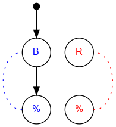

## Challenge #1: Gravity

### Objective

Make all of the blue balls (and only the blue balls) reach the end.

### Setup

`balls:8B-8R; start:B; trace:8B`

### Solution

	 ___o    ___
	|  .\. .-.  |
	| .-./.-.-. |
	|.-.\.-.-.-.|
	|-.-./.-.-.-|
	|.-.\.-.-.-.|
	|-.-./.-.-.-|
	|.-.\.-.-.-.|
	|-.-./.-.-.-|
	|.-.\.-.-.-.|
	|-.-./.-.-.-|
	|     -     |
	|____% %____|

### Diagram

#### Standalone images

Images with title text and objective description:
[SVG](../graph/SVG/puzzle01.svg),
[PNG](../graph/PNG/puzzle01.png),
[PDF](../graph/PDF/puzzle01.pdf).

