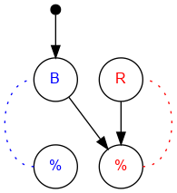

## Challenge #3: Ignition

### Objective

Release one blue ball and then all of the red balls.

### Setup

`balls:8B-8R; start:B; trace:8RB`

### Solution

	 ___o    ___
	|  .\. ./.  |
	| .-.\./.-. |
	|.-.-.\.-.-.|
	|-.-.-.\.-.-|
	|.-.-.-.\.-.|
	|-.-.-.-.\.-|
	|.-.-.-.-./.|
	|-.-.-.-.\.-|
	|.-.-.-.-./.|
	|-.-.-.-.\.-|
	|     -     |
	|____% %____|

### Diagram

#### Standalone images

Images with title text and objective description:
[SVG](../graph/SVG/puzzle03.svg),
[PNG](../graph/PNG/puzzle03.png),
[PDF](../graph/PDF/puzzle03.pdf).

