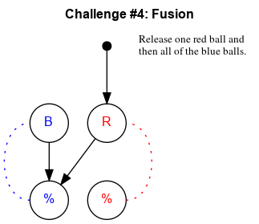

## Challenge #4: Fusion

### Objective

Release one red ball and then all of the blue balls.

### Setup

`balls:8B-8R; start:R; trace:8BR`

### Solution

	 ___    o___
	|  ./. .\.  |
	| ./.-.-.\. |
	|./.-.-.-.\.|
	|\.-.-.-.-./|
	|.\.-.-.-./.|
	|-.\.-.-./.-|
	|.-.\.-./.-.|
	|-.-.\./.-.-|
	|.-.-./.-.-.|
	|-.-./.-.-.-|
	|     -     |
	|____% %____|

### Diagram

