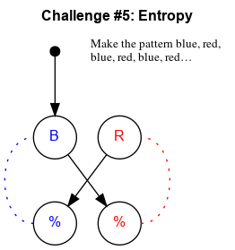

## Challenge #5: Entropy

### Objective

Make the pattern blue, red, blue, red, blue, red…

### Setup

`balls:8B-8R; start:B; trace:8(RB)`

### Solution

	 ___o    ___
	|  .\. ./.  |
	| .-.\./.-. |
	|.-.-.X.-.-.|
	|-.-./.\.-.-|
	|.-.\.-./.-.|
	|-.-./.\.-.-|
	|.-.\.-./.-.|
	|-.-./.\.-.-|
	|.-.\.-./.-.|
	|-.-./.\.-.-|
	|     -     |
	|____% %____|

### Diagram

