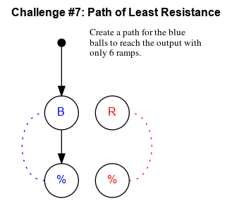

## Challenge #7: Path of Least Resistance

### Objective

Create a path for the blue balls to reach the output with only 6 ramps.

### Setup

`balls:8B-8R; start:B; trace:8B`

### Solution

	 ___o    ___
	|  .\. .-.  |
	| .-./.-.-. |
	|.-.X.X.-.-.|
	|-./.-.-.-.-|
	|.X.-.-.-.-.|
	|\.-.X.-.-.-|
	|.\.-.-.-.-.|
	|-.X.-.-.-.-|
	|.-.X.-.-.-.|
	|-.-./.-.-.-|
	|     -     |
	|____% %____|

### Diagram

#### Standalone images

Images with title text and objective description:
[SVG](../graph/SVG/puzzle07.svg),
[PNG](../graph/PNG/puzzle07.png),
[PDF](../graph/PDF/puzzle07.pdf).

