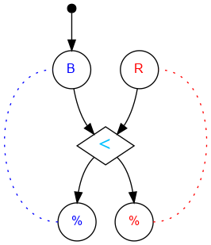

## Challenge #8: Depolarization

### Objective

Make the pattern blue, red, blue, red, blue, red…

### Setup

`balls:8B-8R; start:B; trace:8(RB)`

### Solution

	 ___o    ___
	|  .\. ./.  |
	| .-.\./.-. |
	|.-.-.<.-.-.|
	|-.-./.\.-.-|
	|.-.\.-./.-.|
	|-.-./.\.-.-|
	|.-.\.-./.-.|
	|-.-./.\.-.-|
	|.-.\.-./.-.|
	|-.-./.\.-.-|
	|     -     |
	|____% %____|

### Diagram

#### Standalone images

Images with title text and objective description:
[SVG](../graph/SVG/puzzle08.svg),
[PNG](../graph/PNG/puzzle08.png),
[PDF](../graph/PDF/puzzle08.pdf).

