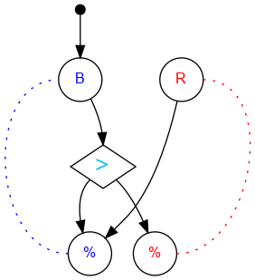

## Challenge #9: Dimers

### Objective

Make the pattern blue, blue, red, blue, blue, red…

### Setup

`balls:10B-10R; start:B; trace:5(RBB)`

### Solution

	 ___o    ___
	|  .>. ./.  |
	| .\.\./.-. |
	|.-.\.X.-.-.|
	|-.-./.\.-.-|
	|.-.\.-./.-.|
	|-.-./.\.-.-|
	|.-.\.-./.-.|
	|-.-./.\.-.-|
	|.-.\.-./.-.|
	|-.-./.\.-.-|
	|     -     |
	|____% %____|

### Diagram

#### Standalone images

Images with title text and objective description:
[SVG](../graph/SVG/puzzle09.svg),
[PNG](../graph/PNG/puzzle09.png),
[PDF](../graph/PDF/puzzle09.pdf).

