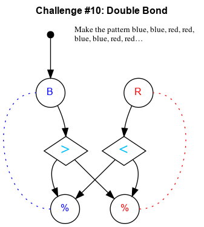

## Challenge #10: Double Bond

### Objective

Make the pattern blue, blue, red, red, blue, blue, red, red…

### Setup

`balls:8B-8R; start:B; trace:4(RRBB)`

### Solution

	 ___o    ___
	|  .>. .<.  |
	| .\.\././. |
	|.-.\.X./.-.|
	|-.-./.\.-.-|
	|.-.\.-./.-.|
	|-.-./.\.-.-|
	|.-.\.-./.-.|
	|-.-./.\.-.-|
	|.-.\.-./.-.|
	|-.-./.\.-.-|
	|     -     |
	|____% %____|

### Diagram

