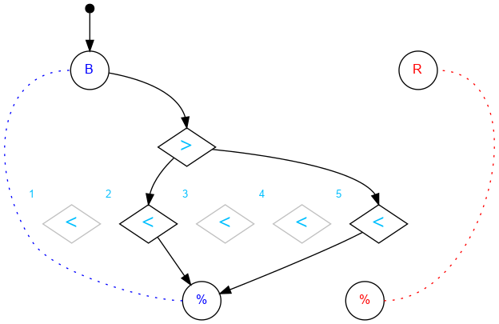

## Challenge #11: Selectivity

### Objective

Flip bits 2 and 5 to the right.

### Setup

`balls:2B-0R; start:B; trace:BB`

### Solution

	 ___o    ___
	|  .\. .-.  |
	| .-.\.-.-. |
	|.-.-.>.-.-.|
	|-.-./.\.-.-|
	|.-./.-.\.-.|
	|-.\.-.-.\.-|
	|.<.<.<.<.<.|
	|-.-./.-.-./|
	|.-./.-.-./.|
	|-./.-.-./.-|
	|     -     |
	|____% %____|

### Diagram

