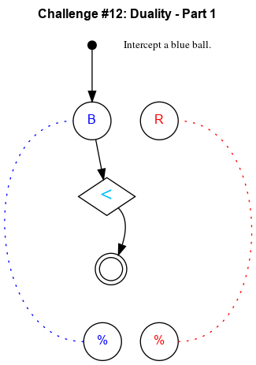

## Challenge #12: Duality - Part 1

### Objective

Intercept a blue ball.

### Setup

`balls:8B-8R; start:B; trace:b`

### Solution

	 ___o    ___
	|  .\. .-.  |
	| .-.\.-.-. |
	|.-.-.<.-.-.|
	|-.-.-.\.-.-|
	|.-.-.-.\.-.|
	|-.-.-.-./.-|
	|.-.-.-./.-.|
	|-.-.-./.-.-|
	|.-.-.U.-.-.|
	|-.-.-.-.-.-|
	|     -     |
	|____% %____|

### Diagram

