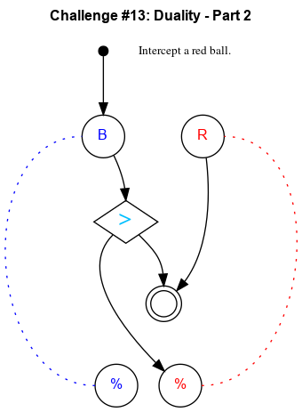

## Challenge #13: Duality - Part 2

### Objective

Intercept a red ball.

### Setup

`balls:8B-8R; start:B; trace:rB`

### Solution

	 ___o    ___
	|  .\. .\.  |
	| .-.\.-./. |
	|.-.-.>./.-.|
	|-.-./.\.-.-|
	|.-./.-.\.-.|
	|-./.-.-./.-|
	|.\.-.-./.-.|
	|-.\.-./.-.-|
	|.-.\.U.-.-.|
	|-.-.\.-.-.-|
	|     \     |
	|____% %____|

### Diagram

