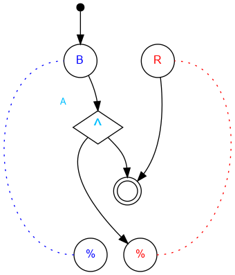

## Challenge #14: Duality - Part 3

### Objective

If the machine starts with bit A pointing to the left, intercept a blue ball. Otherwise, intercept a red ball.

### Setup

`balls:8B-8R; start:B; trace:b|rB`

### Solution

	 ___o    ___
	|  .\. .\.  |
	| .-.\.-./. |
	|.-.-.^./.-.| A
	|-.-./.\.-.-|
	|.-./.-.\.-.|
	|-./.-.-./.-|
	|.\.-.-./.-.|
	|-.\.-./.-.-|
	|.-.\.U.-.-.|
	|-.-.\.-.-.-|
	|     \     |
	|____% %____|

### Diagram

