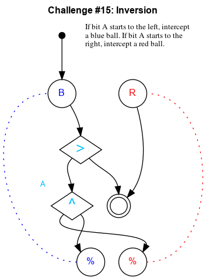

## Challenge #15: Inversion

### Objective

If bit A starts to the left, intercept a blue ball. If bit A starts to the right, intercept a red ball.

### Setup

`balls:8B-8R; start:B; trace:bB|rB`

### Solution

	 ___o    ___
	|  .>. ./.  |
	| .\.\./.-. |
	|.-./.U.-.-.|
	|-.\.-.-.-.-|
	|.-./.-.-.-.|
	|-.\.-.-.-.-|
	|.-.\.-.-.-.|
	|-.-.\.-.-.-|
	|.-.-.^.-.-.| A
	|-.-.\./.-.-|
	|     X     |
	|____% %____|

### Diagram

