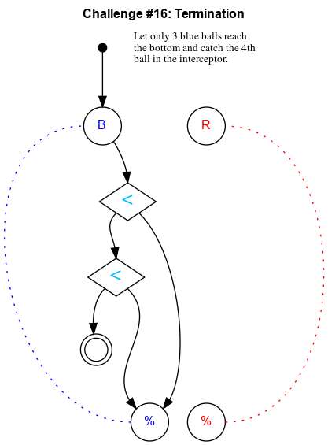

## Challenge #16: Termination

### Objective

Let only 3 blue balls reach the bottom and catch the 4th ball in the interceptor.

### Setup

`balls:8B-8R; start:B; trace:bBBB`

### Solution

	 ___o    ___
	|  .<. .-.  |
	| .\.\.-.-. |
	|.-.<./.-.-.|
	|-.U.\.-.-.-|
	|.-.-./.-.-.|
	|-.-.\.-.-.-|
	|.-.-./.-.-.|
	|-.-.\.-.-.-|
	|.-.-./.-.-.|
	|-.-./.-.-.-|
	|     -     |
	|____% %____|

### Diagram

