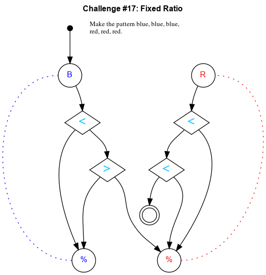

## Challenge #17: Fixed Ratio

### Objective

Make the pattern blue, blue, blue, red, red, red.

### Setup

`balls:8B-8R; start:B; trace:r3R3B`

### Solution

	 ___o    ___
	|  .<. .<.  |
	| ././.\.\. |
	|.\.>.-.<./.|
	|-./.\.U.\.-|
	|.\.-.\.-./.|
	|-./.-.\.\.-|
	|.\.-.-.\./.|
	|-./.-.-.\.-|
	|.\.-.-.-./.|
	|-./.-.-.\.-|
	|     -     |
	|____% %____|

### Diagram

