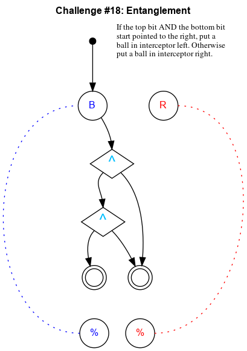

## Challenge #18: Entanglement

### Objective

If the top bit AND the bottom bit start pointed to the right, put a ball in interceptor left. Otherwise put a ball in interceptor right.

### Setup

`balls:8B-8R; start:B; trace:b`

### Solution

	 ___o    ___
	|  .\. .-.  |
	| .-.\.-.-. |
	|.-.-.^.-.-.|
	|-.-.\.\.-.-|
	|.-.-.^./.-.|
	|-.-./.\.-.-|
	|.-.U.-.U.-.|
	|-.-.-.-.-.-|
	|.-.-.-.-.-.|
	|-.-.-.-.-.-|
	|     -     |
	|____% %____|

### Diagram

