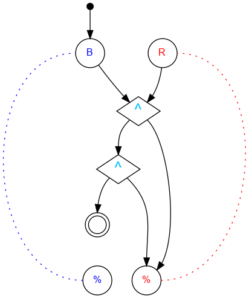

## Challenge #19: Entanglement

### Objective

If the top bit AND the bottom bit start pointed to the right, intercept a blue ball. Otherwise, intercept a red ball.

### Setup 1

`balls:8B-8R; start:B; trace:b|rB`

### Solution 1

	 ___o    ___             ___o    ___
	|  .\. .\.  |           |  .\. ./.  |
	| .-.\.-.\. |           | .-.\.\.-. |
	|.-.-.^.-.\.|           |.-.-.^.\.-.|
	|-.-.\.\.-./|           |-.-.\.\./.-|
	|.-.-.^./.\.|           |.-.-.^.X.-.|
	|-.-./.\.-./|           |-.-.\.X./.-|
	|.-./.-.\./.|           |.-.-./.\.-.|
	|-./.-.-.X.-|           |-.-.\.-./.-|
	|.-.\.-./.\.|           |.-.-./.\.-.|
	|-.-.\./.-./|           |-.-.\.-./.-|
	|     U     |           |     U     |
	|____% %____|           |____% %____|

### Diagram 1

### Setup 2

`balls:8B-8R; start:B; trace:b|rB|rRB|rRRB`

### Solution 2

	 ___o    ___
	|  .\. ./.  |
	| .-.\./.-. |
	|.-.-.^.-.-.|
	|-.-.\.\.-.-|
	|.-.-.^./.-.|
	|-.-.\./.-.-|
	|.-.-.X.-.-.|
	|-.-.\./.-.-|
	|.-.-.X.-.-.|
	|-.-.\.\.-.-|
	|     U     |
	|____% %____|

### Diagram 2

