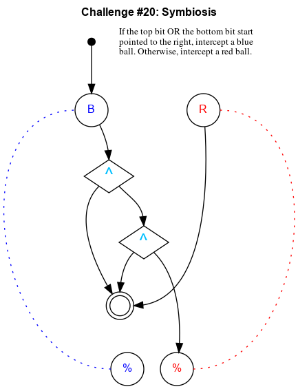

## Challenge #20: Symbiosis

### Objective

If the top bit OR the bottom bit start pointed to the right, intercept a blue ball. Otherwise, intercept a red ball.

### Setup 1

`balls:8B-8R; start:B; trace:b|rB`

### Solution 1

	 ___o    ___
	|  .\. .\.  |
	| .-.\.-.\. |
	|.-.-.^.-.\.|
	|-.-././.-./|
	|.-.\.^.-.\.|
	|-.-./.\.-./|
	|.-.\.-.\./.|
	|-.-./.-.X.-|
	|.-.\.-./.\.|
	|-.-.\./.-./|
	|     U     |
	|____% %____|

### Diagram 1

### Setup 2

`balls:8B-8R; start:B; trace:b|rB`

### Solution 2

	 ___o    ___
	|  .\. ./.  |
	| .-.\./.-. |
	|.-.-.^.-.-.|
	|-.-././.-.-|
	|.-.\.^.-.-.|
	|-.-.\./.-.-|
	|.-.-.X.-.-.|
	|-.-.\./.-.-|
	|.-.-.X.-.-.|
	|-.-.\.\.-.-|
	|     U     |
	|____% %____|

### Diagram 2

