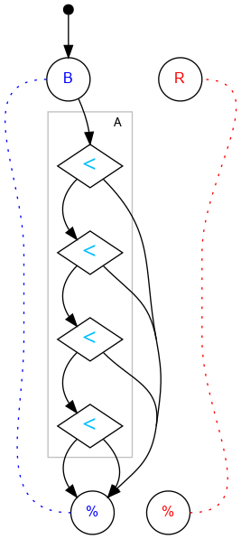

## Challenge #21: Quantum Number

### Objective

Use register A to count the number of blue balls. Use 15 or fewer balls.

### Setup

`balls:15B-0R; start:B; trace:15B`

	 ___o    ___
	|  .<. .-.  |
	| .\.\.-.-. |
	|.-.<./.-.-.|
	|-.\.\.-.-.-|
	|.-.<./.-.-.|
	|-.\.\.-.-.-|
	|.-.<./.-.-.|
	|-.\.\.-.-.-|
	|.-.\./.-.-.|
	|-.-.\.-.-.-|
	|     /     |
	|____% %____|

### Diagram

#### Standalone images

Images with title text and objective description:
[SVG](../graph/SVG/puzzle21.svg),
[PNG](../graph/PNG/puzzle21.png),
[PDF](../graph/PDF/puzzle21.pdf).

