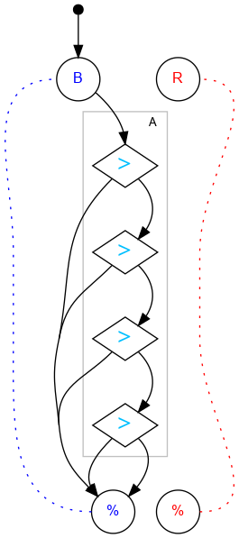

## Challenge #22: Depletion

### Objective

Register A starts at 15. Subtract the number of blue balls from the register. (Use 15 or fewer balls.)

### Setup

`balls:15B 0R; start:B; trace:15B`

### Solution

	 ___o    ___
	|  .>. .-.  |
	| ././.-.-. |
	|.\.>.-.-.-.|
	|-././.-.-.-|
	|.\.>.-.-.-.|
	|-././.-.-.-|
	|.\.>.-.-.-.|
	|-././.-.-.-|
	|.\./.-.-.-.|
	|-./.-.-.-.-|
	|     -     |
	|____% %____|

### Diagram

#### Standalone images

Images with title text and objective description:
[SVG](../graph/SVG/puzzle22.svg),
[PNG](../graph/PNG/puzzle22.png),
[PDF](../graph/PDF/puzzle22.pdf).

