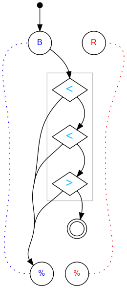

## Challenge #23: Tetrad

### Objective

Let exactly 4 blue balls reach the end. (Intercept the 5th.)

### Setup

`balls:8B-8R; start:B; trace:b4B`

### Solution

	 ___o    ___
	|  .<. .-.  |
	| ././.-.-. |
	|.\.<.-.-.-.|
	|-././.-.-.-|
	|.\.>.-.-.-.|
	|-./.U.-.-.-|
	|.\.-.-.-.-.|
	|-./.-.-.-.-|
	|.\.-.-.-.-.|
	|-./.-.-.-.-|
	|     -     |
	|____% %____|

### Diagram

