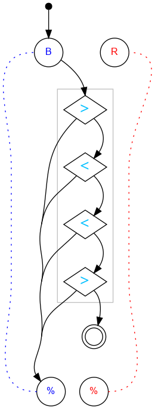

## Challenge #24: Ennead

### Objective

Let exactly 9 blue balls reach the end. (Intercept the 10th.)

### Setup

`balls:12B 12R; start:B; trace:b9B`

### Solution

	 ___o    ___
	|  .>. .-.  |
	| ././.-.-. |
	|.\.<.-.-.-.|
	|-././.-.-.-|
	|.\.<.-.-.-.|
	|-././.-.-.-|
	|.\.>.-.-.-.|
	|-./.U.-.-.-|
	|.\.-.-.-.-.|
	|-./.-.-.-.-|
	|     -     |
	|____% %____|

### Diagram

#### Standalone images

Images with title text and objective description:
[SVG](../graph/SVG/puzzle24.svg),
[PNG](../graph/PNG/puzzle24.png),
[PDF](../graph/PDF/puzzle24.pdf).

