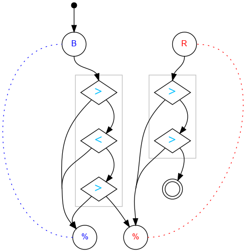

## Challenge #25: Regular Expression

### Objective

Generate the pattern 3R6B.

### Setup

`balls:8B-8R; start:B; trace:r3R6B`

### Solution

	 ___o    ___
	|  .>. .>.  |
	| ././././. |
	|.\.<.\.>.-.|
	|-./././.U.-|
	|.\.>./.-.-.|
	|-./.\.-.-.-|
	|.\.-.\.-.-.|
	|-./.-.\.-.-|
	|.\.-.-.\.-.|
	|-./.-.-.\.-|
	|     -     |
	|____% %____|

### Diagram

#### Standalone images

Images with title text and objective description:
[SVG](../graph/SVG/puzzle25.svg),
[PNG](../graph/PNG/puzzle25.png),
[PDF](../graph/PDF/puzzle25.pdf).

