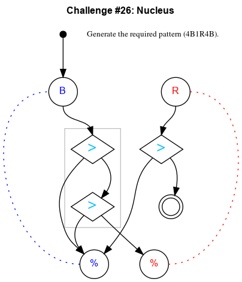

## Challenge #26: Nucleus

### Objective

Generate the pattern 4B1R4B.

### Setup

`balls:10B-10R; start:B; trace:r4B1R4B`

### Solution

	 ___o    ___
	|  .>. .>.  |
	| ./././.U. |
	|.\.>./.-.-.|
	|-./.X.-.-.-|
	|.\./.\.-.-.|
	|-./.-.\.-.-|
	|.\.-.-./.-.|
	|-./.-.\.-.-|
	|.\.-.-./.-.|
	|-./.-.\.-.-|
	|     -     |
	|____% %____|

### Diagram

