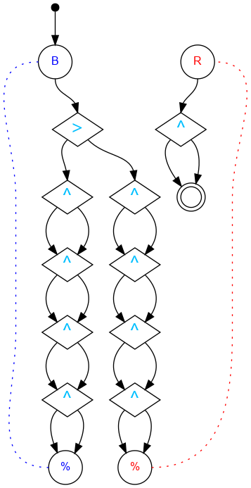

## Challenge #27: Reflection

### Objective

Reverse the direction of each of the 9 starting bits, regardless of the direction they point to start

### Setup

`balls:8B-8R; start:B; trace:rBB`

### Solution

	 ___o   o___
	|  .>. .\.  |
	| .^.\.-.^. |
	|.\./.^.\./.|
	|-.^.\./.U.-|
	|.\./.^.-.-.|
	|-.^.\./.-.-|
	|.\./.^.-.-.|
	|-.^.\./.-.-|
	|.\./.^.-.-.|
	|-./.\./.-.-|
	|     \     |
	|____% %____|

### Diagram

