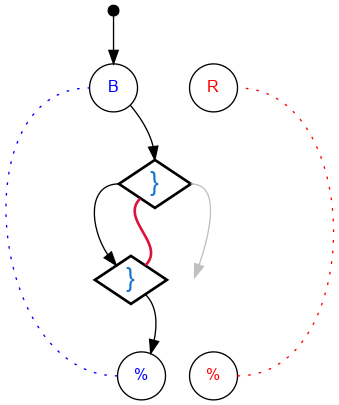

## Challenge #28: Latch

### Objective

Release only the blue balls.

### Setup

`balls:8B-8R; start:B; trace:8B`

### Solution

	 ___o    ___
	|  .\. .-.  |
	| .-.\.-.-. |
	|.-.-.}.-.-.|
	|-.-.}*-.-.-|
	|.-.-./.-.-.|
	|-.-./.-.-.-|
	|.-.\.-.-.-.|
	|-.-./.-.-.-|
	|.-.\.-.-.-.|
	|-.-./.-.-.-|
	|     -     |
	|____% %____|

### Diagram

#### Standalone images

Images with title text and objective description:
[SVG](../graph/SVG/puzzle28.svg),
[PNG](../graph/PNG/puzzle28.png),
[PDF](../graph/PDF/puzzle28.pdf).

