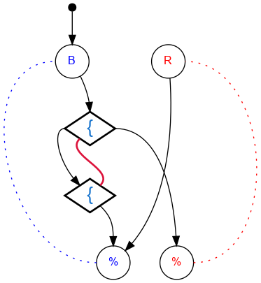

## Challenge #29: One-Shot Switch

### Objective

Release a blue ball, a red ball, and then the rest of the blue balls.

### Setup

`balls:8B-8R; start:B; trace:7BRB`

### Solution

	 ___o    ___
	|  .{. ./.  |
	| .{*\./.-. |
	|.-.\.X.-.-.|
	|-.-./.\.-.-|
	|.-.\.-./.-.|
	|-.-./.\.-.-|
	|.-.\.-./.-.|
	|-.-./.\.-.-|
	|.-.\.-./.-.|
	|-.-./.\.-.-|
	|     -     |
	|____% %____|

### Diagram

#### Standalone images

Images with title text and objective description:
[SVG](../graph/SVG/puzzle29.svg),
[PNG](../graph/PNG/puzzle29.png),
[PDF](../graph/PDF/puzzle29.pdf).

