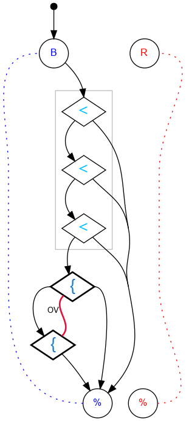

## Challenge #30: Overflow

### Objective

Count the blue balls in register A. If there are more than 7, gear bit OV must flip right (and stay right) to indicate the overflow.

### Setup

`balls:*B-0R; start:B; trace:*B`

### Solution

	 ___o    ___
	|  .<. .-.  |
	| .\.\.-.-. |
	|.-.<./.-.-.|
	|-.\.\.-.-.-|
	|.-.<./.-.-.|
	|-*{./.-.-.-|OV
	|.{./.-.-.-.|
	|\./.-.-.-.-|
	|./.-.-.-.-.|
	|\.-.-.-.-.-|
	|     -     |
	|____% %____|

### Diagram

#### Standalone images

Images with title text and objective description:
[SVG](../graph/SVG/puzzle30.svg),
[PNG](../graph/PNG/puzzle30.png),
[PDF](../graph/PDF/puzzle30.pdf).

